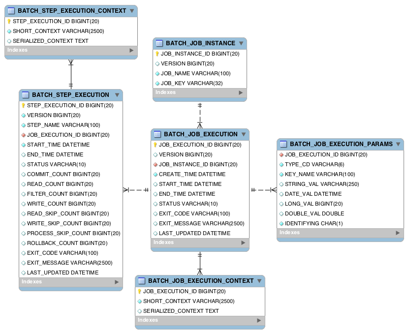
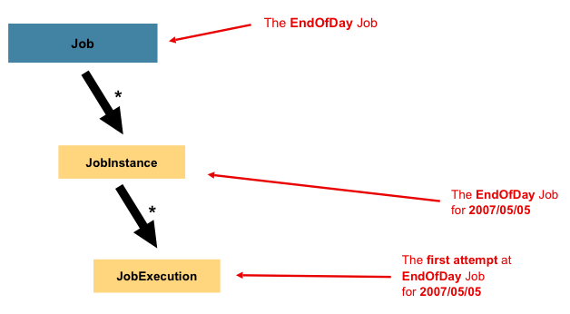
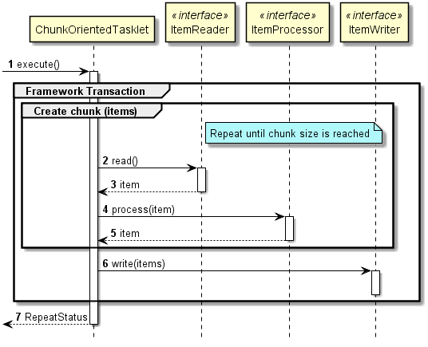

# Spring Batch 분석 & 정리하기
>https://terasoluna-batch.github.io/guideline/5.0.0.RELEASE/en/Ch02_SpringBatchArchitecture.html#Ch02_SpringBatchArch_Overview_SpringBatch

## What is batch application ?

웹 어플리케이션을 많이 개발하다 보니 배치, 배치잡, 크론탭, 스케줄링 등 다양한 용어를 혼합하여 배치라고 부르고 있습니다. 저부터도...  
[위키피디아](https://en.wikipedia.org/wiki/Batch_processing) 의 정의를 보면 **배치 프로세싱 이란 일괄 처리**라고 적혀있습니다.  
주로 웹에서 배치라 함은 **정해진 주기(스케줄링)를 가지고 정해진 작업(Job)을 처리** 하는 것들을 말하죠.  
가령 예를 들면 매출집계, 통계, 메일발송 등을 이런 작업들을 모아서 일괄 처리 하도록 스케줄링을 합니다.  
여기서 중요한 포인트는 스케줄링과 배치 프로세싱은 전혀 다르다는것 입니다. (저는 공부하면서 다시금 깨달았습니다.)  
Spring scheduler(linux cron 같은놈)를 통해 **관리자 페이지 내부에 주로 사용자가 없는 시간에 정해진 주기를 두고,**  
**위의 일괄처리가 필요한 작업들을 코드로 구현해 놓고 사용 했습니다.**

### 정리 하자면 배치라고 부르는 작업과 스케줄링 전혀 다른 개념 이라는거를 꼭 이해 하시고 넘어가면 되겠습니다. (아시면 Pass) 🥳

**스케줄러는 정해진 주기를 가지고 특정 업무를 수행할수 있도록 지원하는 것,  
배치는 사용자와의 상호 작용 없이 원하는 작업을 정해진 순서에 따라 일괄 적으로 처리하는 비지니스 로직 구간 입니다.  
즉 위의 스케줄러가 호출하게 될 실제 구현체 부분입니다.**

### 배치 애플리케이션의 조건

> 배치 애플리케이션은 아래의 조건을 만족해야 합니다.

-   **대용량 데이터 처리**: 대량의 데이터를 가져오고, 전달, 계산하는 등의 처리를 할 수 있어야 합니다.
-   **자동화**: 사용자의 개입 없이 실행 되어야 합니다.
-   **견고성**: 잘못된 데이터가 있더라도 충돌/중단 없이 처리할 수 있어야 합니다.
-   **신뢰성**: 무엇이 잘못되었는지를 추적할 수 있어야 합니다.(로깅, 알림)
-   **성능**: 지정한 시간 안에 처리를 완료하거나, 동시에 실행되는 다른 애플리케이션에 영향 없이 수행되어야 합니다.

## What is Spring Batch ?

Spring Batch는 엔터프라이즈 시스템의 일상적인 운영에 필수적인 강력한 배치 애플리케이션을 개발할 수 있도록 설계된 가볍고 포괄적 인 배치 프레임 워크입니다.  
Spring Batch는 사람들이 기대하는 Spring Framework의 특성을 기반으로 구축되며, 개발자가 필요할 때 더 진보 된 엔터프라이즈 서비스에 쉽게 액세스하고 활용할 수 있도록 합니다.  
**Spring Batch는 스케줄링 프레임 워크가 아닙니다.**  
상용 및 오픈 소스 공간 모두에서 사용할 수있는 좋은 엔터프라이즈 스케줄러 (예 : Quartz, Tivoli, Control-M 등)가 많이 있습니다.  
**스케줄러를 대체하는 것이 아니라 스케줄러와 함께 작동하기위한 것입니다.**

Spring Batch는 로깅 / 추적, 트랜잭션 관리, 작업 처리 통계, 작업 재시작, 건너 뛰기, 리소스 관리 등 대량의 레코드 처리에 필수적인 재사용 가능한 기능을 제공합니다.  
또한 최적화 및 파티셔닝 기술을 통해 대용량 및 고성능 배치 작업을 가능하게하는 고급 기술 서비스 및 기능을 제공합니다.  
Spring Batch는 단순한 사용 사례 (예 : 데이터베이스로 파일 읽기 또는 저장 프로 시저 실행)뿐만 아니라 복잡한 대용량 사용 사례 (예 : 데이터베이스간에 대량의 데이터 이동, 변환 등에서 사용할 수 있습니다.) 대용량 배치 작업은 확장 성이 뛰어난 방식으로 프레임 워크를 활용하여 많은 양의 정보를 처리 할 수 ​​있습니다.

## Why should we use Spring Batch ?

Spring Batch는 이러한 기본 배치 반복을 자동화하여 일반적으로 사용자 상호 작용없이 오프라인 환경에서 유사한 트랜잭션을 집합으로 처리 할 수있는 기능을 제공합니다.  
배치 작업은 대부분의 IT 프로젝트의 일부이며 Spring Batch는 강력한 엔터프라이즈 급 솔루션을 제공하는 유일한 오픈 소스 프레임 워크입니다.

**Spring Batch의 비즈니스 시나리오**

-   주기적으로 배치 프로세스 커밋
-   동시 일괄 처리 : 작업의 병렬 처리
-   단계별 엔터프라이즈 메시지 기반 처리
-   대규모 병렬 일괄 처리
-   실패 후 수동 또는 예약 된 재시작
-   종속 단계의 순차적 처리 (워크 플로 기반 배치에 대한 확장 포함)
-   부분 처리 : 레코드 건너 뛰기 (예 : 롤백시)
-   배치 크기가 작거나 기존 저장 프로 시저 / 스크립트가있는 경우 전체 배치 트랜잭션

**Spring Batch의 기술 목표**

-   배치 개발자는 Spring 프로그래밍 모델을 사용합니다. **비즈니스 로직에 집중하여 프레임워크로 인프라를 관리**합니다.
-   인프라스트럭처, 배치 실행 환경 및 배치 애플리케이션 간 우려사항의 명확한 분리.
-   모든 프로젝트를 구현할 수 있는 인터페이스로서 공통의 핵심 실행 서비스를 제공합니다.
-   핵심 실행 인터페이스의 심플하고 디폴트 실장을 제공하며, "개봉 후"에 사용할 수 있습니다.
-   모든 레이어에서 스프링 프레임워크를 이용함으로써 서비스 설정, 커스터마이즈 및 확장이 용이합니다.
-   기존의 모든 핵심 서비스는 인프라스트럭처 층에 영향을 주지 않고 쉽게 교체하거나 확장할 수 있어야 합니다.
-   Maven을 사용하여 구축된 아키텍처 JAR을 애플리케이션에서 완전히 분리한 심플한 배치 모델을 제공합니다.

---

> 본 글은 스프링 배치의 도큐먼트와 이동욱님의 블로그를 보고 재편성 하였습니다.  
> [이동욱님 스프링배치](https://jojoldu.tistory.com/324)  
> [Spring Batch Document](https://docs.spring.io/spring-batch/docs/4.3.x/reference/html/index.html)

제 글로 이해가 안가시는 분들은 꼭 방문하여 한번 읽어 보시는것이 이해에 더 많은 도움을... 😱

다음엔 Spring Batch의 매커니즘 그리고 기본 용어들에 대해서 알아보겠습니다.

잘못된 정보나 문제가 될 부분들은 꼭!! 피드백 부탁드립니다 😳😳

---
---
--- 


# The Domain Language of Batch

## Components of Spring Batch


🙄  위의 다이어그램은 Spring Batch의 도메인 언어를 구성하는 주요 개념을 나타내고 있습니다.  
`Job`에는 1개 이상의 `Step`이 있고 각각 `ItemReader`, `ItemProcessor`, `Item Writer` 1개씩 있습니다.  
`Job`의 실행은 `JobLauncher`를 사용하고, 현재 실행중인 프로세스에 관한 메터데이터를 `JobRepository`에 저장합니다.

### 2- Metadata table
> [schema for spring batch docs](https://docs.spring.io/spring-batch/docs/4.3.x/reference/html/schema-appendix.html#metaDataSchema)
위 도큐먼트를 보시면 위의 `JobRepository`에 대해 좀더 이해를 하실수 있습니다.
> 잠깐 설명 드리면 스프링 배치 내부에서 잡들에 대한 실행 히스토리들을 저장하고 남기는 부분을 말한다고 생각 하시면 됩니다.
> 아래 ERD를 확인 하시고 대략적인 냄새를 맡아주세요 !!! 🤧😬😬  




### Job
`Job`은 배치 프로세스 전체를 캡슐화하는 엔티티 입니다.  
다른 Spring 프로젝트와 마찬가지로 `Job`은 XML Configuration 파일 또는 Java 기반 Configuration과 함께 연결됩니다. 이 구성을 "작업 구성"이라고 부르기도 합니다.  
그러나 아래 다이어 그램과 같이 `Job`은 전체 작업 계층 구조의 시작입니다.

#여기까지 !!!!함 !!!!
### Step 

배치 장인 이동욱(jojoldu)님 께서는 순차적인 `Job`들을 나눌때 `Step`을 통해 구분 하기 보다는, `Step`들도 개별 적인 동작을 할 수 있도록 구성하는 것을 추천 합니다.(유지보수의 편의성 및 추상화)

### 2-1 !!!추가 기재필요 !!! Job, Step, Tasklet or (Reader, Processor, Writer)

### Chunk Oriented Tasklet (청크 지향 처리)
**Chunk 지향 처리**는 트랜잭션 경계 내에서 Chunk 단위로 데이터를 읽고 생성하는 기법입니다.  
Chunk란 아이템이 트랜잭션에서 커밋되는 수를 말합니다. 읽어온 데이터를 지정된 Chunk 수에 맞게 트랜잭션 커밋을 진행합니다.

예를 들어 1천 개의 데이터를 업데이트해야 한다고 해보겠습니다.  
이럴 경우 위에서 말한 **Tasklet 방식 이나 청크로 데이터를 지정하지 않은 경우 천 개의 데이터에 변경을 한 번에 해야 합니다.**   
이렇게 되면 천 개의 데이터 중 한 개의 데이터라도 업데이트를 실패하여 Exception 발생할 경우 **천 개의 데이터를 롤백 해야 합니다.**   
또한 트랜잭션 시간을 길게 가져감으로써 데이터베이스로부터 읽어온 데이터들이 lock이 걸리게 됩니다.  
이러한 문제를 해결하기 위해서는 **Chunk 지향 처리를 이용**합니다.  
**Chunk 단위로 transaction을 수행하기** 때문에 실패할 경우 해당 Chunk 만큼만 Rollback이 되고, 이전에 커밋된 transaction 범위는 반영이 됩니다.  



- Reader에서 아이템을 하나 읽어옵니다.
- 읽어온 아이템을 Processor에서 가공합니다.
- 가공된 데이터들을 별도의 공간에 모은 뒤, Chunk 단위만큼 쌓이게 되면 Writer에 전달 하여 저장합니다.
- 자바 코드로 표현 하면 다음과 같습니다.

``` java
// chunkSize 단위로 묶어서 처리한다.
for(int i = 0; i < totalSize; i += chunkSize) {
    List items = new ArrayList();
    for(int j=0; j < chunkSize; j++) {
        Object item = itemReader.read();
        Object processedItem = itemProcessor.process(item);
        items.add(processedItem);
    }
    itemWriter.write(items);
}

```

### ItemReader
- 이름에서 알수 있듯이 데이터를 읽어 들입니다.  
DB의 데이터 뿐만 아니라 File, XML, JSON등 다른 데이터 소스를 배치 처리의 입력으로 사용할 수 있습니다.  
또한 JMS(Java Message Service)와 같은 다른 유형의 데이터 소스도 지원합니다. 
이외에도 **Spring Batch에서 지원하지 않는 Reader가 필요할 경우 직접 Reader를 만들수 있습니다.**
Spring Batch는 이를 위해 Custom Reader 구현체를 만들기 쉽게 제공하고 있습니다.  

**Reader에서 읽어올 수 있는 데이터 유형**
- Input Data
- File
- Database
- Java Message Service등 다른 소스에서 읽어오기
- Custom Reader

 

### 2- Metadata table
> [schema for spring batch docs](https://docs.spring.io/spring-batch/docs/4.3.x/reference/html/schema-appendix.html#metaDataSchema)

배치 하나가 하나의 Job 이며, 여러개의 Step 이 모여 Job 을 이루게 된다. 다만, Step 은 Reader , Processor, Writer 가 Tasklet 로 대체 될 수 있는데 이것은 하나의 큰 덩어리로 나의 경우 굳이 3분류로 나누지 않고 각 스텝별로 Tasklet 단위로 작성을 하는게 기능 별로 정의하는 느낌적인 느낌.


### 3-1 Spring Batch 관리 도구들 (Tools)
>**호출방식 2가지** CLI 통한 jar 실행, Java 내부 호출 통한 실행

**1. Cron** - Linux cron scheduling execute jar
**2. Spring MVC + API Call** - 웹 MVC 내부에서 Rest API 내부에서 호출
**3. Spring Batch Admin (Deprecated)** - Spring Cloud Data Flow 사용하라고 하나 분석 필요.
**4. Quartz + Admin** - quartz로 Admin페이지를 만들어서 scheduling 하여 호출
**5. CI Tools (Jenkins/Teamcity/...)** - CI 툴을 이용해서 호출

### 3-2 @jojuldu 갓 형님은 jenkins 추천
- integration(Slack, Email ...): event에 대한 callback 처리가 장점
- 실행이력 / 로그관리 / Dashboard
- 다양한 실행 방법 (Rest API / 스케줄링 / 수동 실행): job별로 rest api를 지원해서 admin에 추가해서 호출 가능
- 계정 별 권한 관리
- pipe line: 
- Web UI + Script 둘다 사용 가능
- Plugin (ansible, Github, Logentries ...)

3,4번 같은 경우는 별도의 Admin UI 구성하여서 처리 하기 때문에 공수가 더 추가된다.

### 3-3 Jenkins & Batch Jar 실행 명령

``` bash
java -jar \
-Dspring.profiles.active={Spring 프로파일} \
${BATCH_JAR_HOME}/setter_batch.jar \
--job.name={job 이름} \
baseDate=${baseDate} \
version=${VERSION} \
```

``` bash
java -jar \
-XX:+UseG1GC \
-Dspring.profiles.active={Spring 프로파일} \
${BATCH_JAR_HOME}/setter_batch.jar \
--job.name={job 이름} \
baseDate=${baseDate} \
version=${VERSION} \
```

- 실행시 공통으로 사용하는 환경변수를 Jenkins config를 사용하자.  
Global properties 사용해서 환경변수를 선언해 놓고 사용하면 shell script에서 공통 사용

### 3-4 무중단 배포
> linux link, readlink 확인 !
배포를 하기 위해서 모든 배치잡이 실행 완료를 기다려야 하는 상황이 생긴다.
배포, 배치 젠킨스를 분리하여서 사용하고, 배포시 실행중인 jar파일과 충돌이 나지 않도록 해야한다.

### 3-5 Tips
**여러 작업이 순차적으로** 실행이 필요할때 Step으로 나누기 보다는 **파이프라인을 우선** 고려한다.
A -> B -> C 의 순서로 Job이 구성되어 있고 Step으로 구분지을 경우 A,B,C의 개별적인 스탭을 실행할 수가 없다.  
구성할 당시에는 개별 실행의 이슈가 없다고 하더라도 절대적...일까??? 때문에 파이프라인을 우선 고려 하는것이 좋다.

### 3-6 Test
1. @ConditionalOnProperty() / @TestPropertySource(properties = "job.name=")
위의 어노테이션을 이용한 테스트 작성
2. 테스트 케이스가 100개 이상 부터 속도 저하 발생.
    - Environment가 변경될떄 Spring Context를 재시작
    - @ConditionalOnProperty()가 환경을 변경하면서 테스트 메소드 실행을 하기 위해 매번 스프링 리로드.
3. Environment가 변경되는 조건
    - 테스트 코드에서 @MockBean / @SpyBean 사용시
    - 테스트 코드에서 @TestPropertySource로 환경변수 변경시
    - @ConditionalOnProperty로 테스트마다 Config가 다를때

### 3-7 JPA + Batch
1. N+1 Issue
    - Join Fetch
    - default_batch_fetch_Size 설정 사용
    - JpaPagingItemReader 에서는 작동 X / HibernateCursorItemReader는 가능
